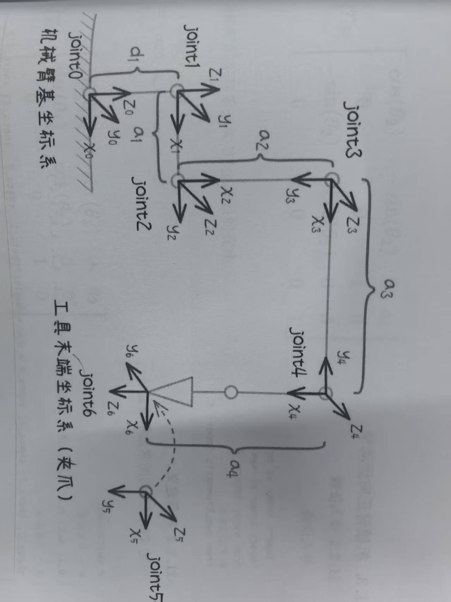

# E01 学习日志

## 学习日期：2026-05-03

**执行人**：章大帅
**总耗时**：约 1.5 小时（文档学习 + 实物观察）

***

## 学习目标

不看说明书，能徒手画出整车的四大组成（移动底盘 / 协作机械臂 / 视觉 / 激光雷达）+ 各传感器位置 + 4 个伺服电机编号方向。

***

## 关键问题及答案

### 1. 4 个伺服电机编号方向

**答**：从车头左侧开始，顺时针编号 1→2→3→4。车头方向是电源键所在面。

### 2. 视觉相机布局

**答**：深度相机实际安装在**龙门架上**（非机械臂末端），属于 eye-to-hand 布局。

### 3. 激光雷达盲区

**答**：RPLidar A3M12 装在底盘顶部中央，盲区包括：

- 底盘正下方
- 机械臂遮挡区域
- 低矮障碍物（雷达扫描面以下）

### 4. 独立悬架 + 充气胎的好处

**答**：茶园地面不平整（土坎、沟壑、坡度），独立悬架让每轮自适应地面起伏，充气胎减震好、抓地力强、不易打滑。

### 5. IMU 是什么？装在哪？

**答**：IMU = 惯性测量单元（北微传感 N100），内含加速度计 + 陀螺仪 + 磁力计。装在底盘中心金属外壳内，用于姿态估计、航位推算、辅助 SLAM。不装机械臂末端是因为末端振动太大，数据全是噪声。

***

## 实物观察记录

| 检查项                                | 状态 |
| ---------------------------------- | -- |
| 绕整车看四个面                            | ✅  |
| 车头方向确认（电源键所在面）                     | ✅  |
| 找到 4 个伺服电机，按顺时针标 1/2/3/4           | ✅  |
| 找到深度相机（龙门架上）                  | ✅  |
| 找到 RPLidar A3M12（底盘顶部中央）           | ✅  |
| 找到 IMU N100（底盘中心金属外壳内）             | ✅  |
| 找到 G3P 二指夹持器                       | ✅  |
| 测底盘外形（约 912×710×410 mm）和轴距（500 mm） | ✅  |

**实际发现与文档差异**：

- 深度相机 <!-- 2026-05-03 lsusb实测修正 --> 实际装在龙门架上，非机械臂末端
- G3P 为二指夹持器（文档原写"三指"）

***

## 整车组成（五大模块）

### 1. 移动底盘 — Zeus S2

| 参数   | 值                  |
| ---- | ------------------ |
| 外形尺寸 | 912 × 710 × 410 mm |
| 轴距   | 500 mm             |
| 驱动   | 4 轮独立伺服电机（直流）      |
| 轮胎   | 充气胎 + 独立悬架         |
| 电机编号 | 车头左侧 → 顺时针 1→2→3→4 |

### 2. 协作机械臂 — ROCR6

| 参数    | 值                    |
| ----- | -------------------- |
| 类型    | 6 自由度串联协作机械臂         |
| 末端执行器 | G3P 二指夹持器            |
| 运动学求解 | DH 参数法（正解）+ IK 逆解求解器 |

### 3. 视觉系统 — 深度相机（奥比中光 Orbbec）

| 参数   | 值                     |
| ---- | --------------------- |
| 类型   | RGB-D 深度相机             |
| 厂商   | 奥比中光 Orbbec（lsusb ID `2bc5:0614`） |
| 安装位置 | 龙门架上                  |
| 用途   | 目标检测 + 深度感知 + 视觉伺服    |

### 4. 激光雷达 — RPLIDAR A3M12

| 参数   | 值                   |
| ---- | ------------------- |
| 类型   | 2D 单线激光雷达           |
| 安装位置 | 底盘顶部中央              |
| 视场   | 360° 水平全向扫描         |
| 盲区   | 底盘正下方、机械臂遮挡区域、低矮障碍物 |

### 5. 惯性测量单元 — IMU N100

| 参数    | 值                 |
| ----- | ----------------- |
| 型号    | 北微传感 N100         |
| 安装位置  | 底盘中心金属外壳内         |
| 内部传感器 | 加速度计 + 陀螺仪 + 磁力计  |
| 用途    | 姿态估计、航位推算、辅助 SLAM |

***

## 俯视图（传感器布局）

```
                    ↑ 车头（电源键所在面）
        ┌───────────────────────────┐
        │       RPLidar A3M12       │  ← 顶部中央
        │         (360°)            │
        │                           │
    ┌───┼───┐               ┌───┼───┐
    │ M1│   │               │ M2│   │  ← M1=电机1, M2=电机2
    └───┼───┘               └───┼───┘
        │                       │
        │     底盘本体          │
        │                       │
    ┌───┼───┐               ┌───┼───┐
    │ M3│   │               │ M4│   │  ← M3=电机3, M4=电机4
    └───┼───┘               └───┼───┘
        │                       │
        │   IMU N100 (中心)     │
        └───────────────────────────┘
```

**4 个伺服电机编号**：从车头左侧开始，顺时针 M1→M2→M4→M3

***

## 侧视图（机械臂 + 传感器）

```
                      深度相机 <!-- 2026-05-03 lsusb实测修正 --> 相机
                      （龙门架上）
                         │
                         ▼
                    ┌────────┐
                    │ G3P 夹爪│  ← 工具末端坐标系 (x₆,y₆,z₆)
                    └────────┘
                         │
                    ┌────┴────┐   joint6
                    │   腕部 2 │  ─ (x₅,y₅,z)
                    └────┬────┘   joint5
                         │
                    ┌────┴────┐   joint4
                    │   腕部 1 │  ─ (x₄,y₄,z₄)
                    └────────
                         │        a₃
                    ────┴────┐
                    │   肘部  │  ─ (x₃,y₃,z)  ← joint3
                    └────────┘
                         │        a₂
                    ────┴────┐
                    │   肩部  │  ── (x₂,y₂,z₂)  ← joint2
                    ────┬────┘
                         │        a₁
                    ┌────┴────┐
                    │ 基座旋转│  ── (x₁,y₁,z₁)  ← joint1
                    └────┬────┘
                         │   d₁
                    ┌────┴────┐
                    │   底盘  │  ── (x₀,y₀,z₀)  ← joint0 (基坐标系)
                    │  RPLidar│  ↑
                    └─────────┘
```

***

## 传感器接入方式

| 设备            | 接口类型     | 连接方式    | 波特率/协议     |
| ------------- | -------- | ------- | ---------- |
| RPLIDAR A3M12 | USB      | USB-TTL | 256000 bps |
| IMU N100      | USB      | USB-TTL | 115200 bps |
| Zeus S2 底盘    | USB      | USB-TTL | 115200 bps |
| ROCR6 机械臂     | Ethernet | TCP/IP  | ROS 控制     |
| 深度相机 <!-- 2026-05-03 lsusb实测修正 --> 相机      | USB 3.0  | libuvc  | UVC 协议     |
| G3P 夹爪        | —        | —       | 与机械臂集成     |

***

## ROCR6 机械臂 DH 参数坐标系



### 坐标系说明

| 关节     | 坐标系          | 旋转轴 | 说明       |
| ------ | ------------ | --- | -------- |
| joint0 | (x₀, y₀, z₀) | z₀  | 机械臂基坐标系  |
| joint1 | (x₁, y₁, z₁) | z₁  | 基座旋转     |
| joint2 | (x₂, y₂, z₂) | z₂  | 肩部       |
| joint3 | (x₃, y₃, z)  | z₃  | 肘部       |
| joint4 | (x₄, y, z₄)  | y₄  | 腕部1      |
| joint5 | (x, y₅, z₅)  | y₅  | 腕部2      |
| joint6 | (x₆, y₆, z₆) | z₆  | 工具末端（夹爪） |

### DH 参数对应

- **a₁, a₂, a₃, a₄**：连杆长度（沿 x 轴方向）
- **d₁**：沿 z₀ 轴的偏移距离
- 每个关节绕 zᵢ 轴（joint0-joint3, joint6）或 y 轴（joint4-joint5）旋转

